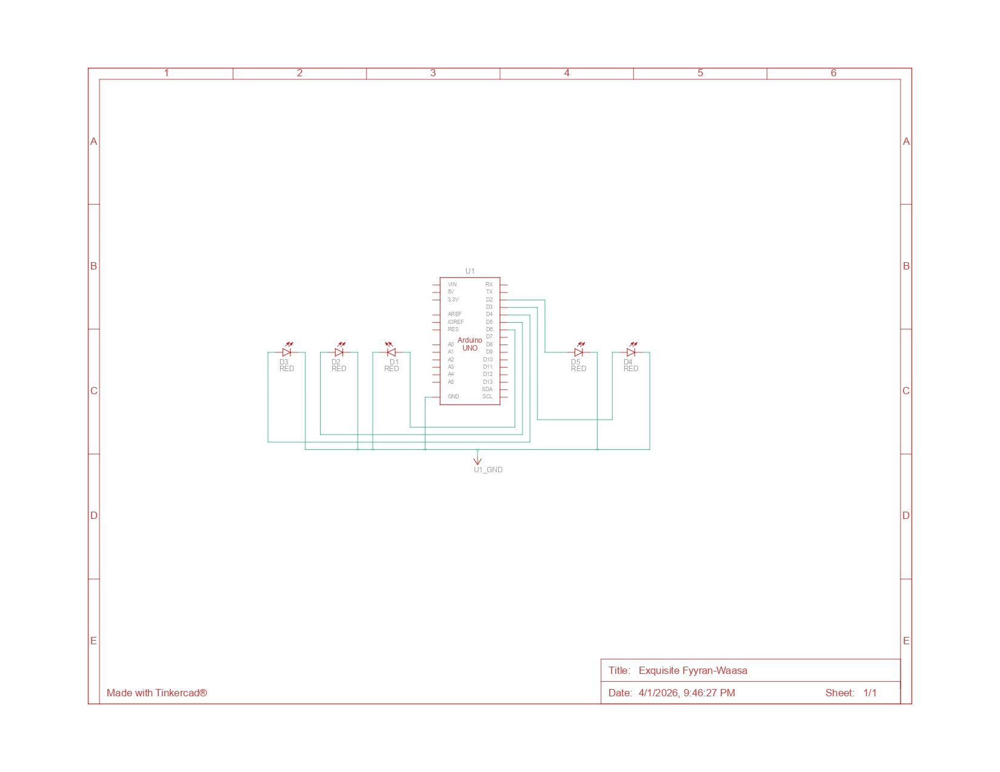

## PRAKTIKUM PEMROGRAMAN SISTEM TERTANAM

## Pertanyaan Praktikum Modul 1: Perulangan

1. Gambarkan rangkaian schematic 5 LED running yang digunakan pada percobaan!
2. Jelaskan bagaimana program membuat efek LED berjalan dari kiri ke kanan!
3. Jelaskan bagaimana program membuat LED kembali dari kanan ke kiri!
4. Buatkan program agar LED menyala tiga LED kanan dan tiga LED kiri secara bergantian dan berikan penjelasan disetiap baris kode nya dalam bentuk README.md!

## Jawaban

### 1. Rangkaian Skematik 5 LED



### 2. Efek LED Kembali dari Kiri ke Kanan

Efek ini dihasilkan oleh blok for loop pertama di dalam fungsi loop():

- **Inisialisasi:** Program memulai dengan int ledPin = 2.
- **Kondisi:** Loop berjalan selama ledPin < 7 (artinya pin 2, 3, 4, 5, dan 6).
- **Aksi**: Di setiap putaran, satu LED dinyalakan (HIGH), ditahan sebentar dengan delay(timer), lalu dimatikan kembali (LOW).
- **Hasil:** Karena angka pin bertambah satu demi satu (ledPin++), lampu terlihat "berjalan" maju dari pin kecil ke pin besar.

### 3. Efek LED Kembali dari Kanan ke Kanan

Efek balik ini dihasilkan oleh blok for loop kedua:

- **Inisialisasi:** Dimulai dari pin tertinggi, yaitu int ledPin = 7. Namun, perlu dicatat pada kode aslimu ada sedikit overlap karena mulai dari 7, sementara setup hanya sampai 6.

- **Kondisi:** Loop berjalan mundur selama ledPin >= 2.

- **Aksi:** Menggunakan perintah ledPin-- (decrement) untuk mengurangi angka pin di setiap putaran.

- **Hasil:** LED menyala bergantian dari pin 6 menuju ke pin 2, menciptakan efek gerakan mundur.

### 4. Modifikasi Source Code

#### Kode Program

```ino
int timer = 500; // Kecepatan kedip

void setup() {
  // Inisialisasi pin 2 sampai 7 sebagai OUTPUT
  for (int i = 2; i <= 7; i++) {
    pinMode(i, OUTPUT);
  }
}

void loop() {
  // MENYALAKAN 3 LED KIRI (Pin 2, 3, 4)
  digitalWrite(2, HIGH);
  digitalWrite(3, HIGH);
  digitalWrite(4, HIGH);
  digitalWrite(5, LOW);  // Pastikan kanan mati
  digitalWrite(6, LOW);
  digitalWrite(7, LOW);
  delay(timer);

  // MENYALAKAN 3 LED KANAN (Pin 5, 6, 7)
  digitalWrite(2, LOW);   // Pastikan kiri mati
  digitalWrite(3, LOW);
  digitalWrite(4, LOW);
  digitalWrite(5, HIGH);
  digitalWrite(6, HIGH);
  digitalWrite(7, HIGH);
  delay(timer);
}
```

#### Deskripsi Logika

Program ini membagi 6 LED menjadi dua grup:

- Grup Kiri: Pin 2, 3, dan 4.
- Grup Kanan: Pin 5, 6, dan 7.

Penjelasan Baris Kode

- int timer = 500; : Menentukan durasi nyala lampu dalam milidetik.

- void setup() : Fungsi yang berjalan sekali untuk mengatur mode pin.

- pinMode(i, OUTPUT); : Mengatur pin digital agar bisa mengalirkan listrik ke LED.

- void loop() : Fungsi yang berjalan terus-menerus.

- digitalWrite(pin, HIGH); : Memberikan tegangan pada pin sehingga LED menyala.

- digitalWrite(pin, LOW); : Memutus tegangan pada pin sehingga LED mati.

- delay(timer); : Memberikan jeda agar mata manusia bisa melihat perubahan nyala lampu sebelum berpindah ke perintah berikutnya.
