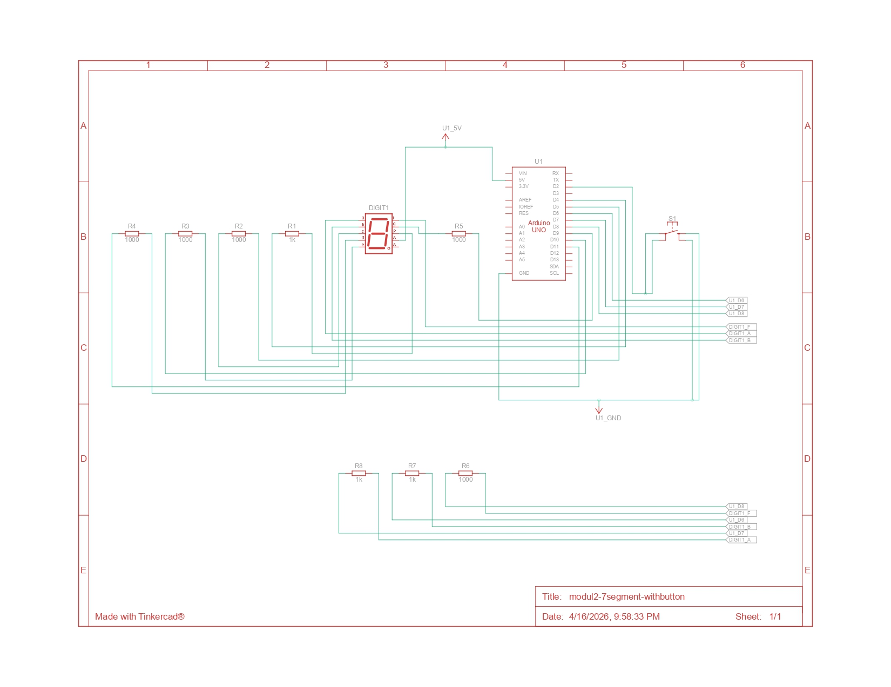

## PRAKTIKUM PEMROGRAMAN SISTEM TERTANAM

## Pertanyaan Praktikum Modul 2: Seven segment

1. Gambarkan rangkaian schematic yang digunakan pada percobaan!
2. Mengapa pada push button digunakan mode INPUT_PULLUP pada Arduino Uno? Apa keuntungannya dibandingkan rangkaian biasa?
3. Jika salah satu LED segmen tidak menyala, apa saja kemungkinan penyebabnya dari sisi hardware maupun software?
4. Modifikasi rangkaian dan program dengan dua push button yang berfungsi sebagai penambahan (increment) dan pengurangan (decrement) pada sistem counter dan berikan penjelasan disetiap baris kode nya dalam bentuk README.md

## Jawaban

### 1. Rangkaian Skematik



### 2. Push button mode INPUT_PULLUP

Push button menggunakan mode `INPUT_PULLUP` agar pin input Arduino memiliki kondisi default yang stabil, yaitu `HIGH`, tanpa perlu resistor pull-up eksternal.

Saat tombol belum ditekan:

- Pin akan terbaca `HIGH` karena ditarik ke VCC oleh resistor pull-up internal.

Saat tombol ditekan:

- Pin terhubung ke GND sehingga terbaca `LOW`.

Keuntungan `INPUT_PULLUP` dibandingkan rangkaian biasa:

- Tidak perlu resistor eksternal, sehingga rangkaian lebih sederhana.
- Mengurangi jumlah komponen yang digunakan.
- Membantu mencegah kondisi `floating` pada pin input.
- Pembacaan tombol menjadi lebih stabil dan tidak mudah terganggu noise.
- Lebih praktis untuk percobaan di breadboard.

### 3. Penyebab LED tidak menyala dari sisi hardware maupun software

Jika salah satu LED segmen tidak menyala, kemungkinan penyebabnya bisa berasal dari sisi **hardware** maupun **software**.

Kemungkinan dari sisi hardware:

- Kaki segmen pada seven segment tidak terhubung dengan benar ke Arduino.
- Kabel jumper longgar atau putus.
- Resistor pembatas arus rusak atau nilainya tidak sesuai.
- Salah satu pin Arduino yang terhubung ke segmen bermasalah.
- LED segmen pada seven segment memang rusak.
- Penyusunan kaki seven segment pada breadboard salah posisi.

Kemungkinan dari sisi software:

- Nomor pin pada array `segmentPins` tidak sesuai dengan rangkaian asli.
- Pola pada `digitPattern` untuk segmen tertentu salah.
- Program mengirim logika terbalik terhadap jenis seven segment yang digunakan.
- Fungsi `displayDigit()` tidak memanggil data segmen dengan benar.
- Indeks data yang ditampilkan salah sehingga pola segment tidak sesuai.

Jadi, jika satu segmen tidak menyala, perlu dicek koneksi fisik, kondisi komponen, serta kesesuaian logika program dengan jenis seven segment yang dipakai.

### 4. Modifikasi Program

```ino
// ============================== PIN ==============================
const int segmentPins[8] = {7, 6, 5, 11, 10, 8, 9, 4};
// Array pin untuk segmen a, b, c, d, e, f, g, dan dp

const int btnUp = 2;
// Tombol untuk menambah nilai counter
const int btnDown = 3;
// Tombol untuk mengurangi nilai counter

// ============================== DATA ==============================
// Pola disusun 1 = ON dan 0 = OFF, lalu dibalik saat output karena rangkaian common anode
byte digitPattern[16][8] = {
  {1,1,1,1,1,1,0,0}, // Pola angka 0
  {0,1,1,0,0,0,0,0}, // Pola angka 1
  {1,1,0,1,1,0,1,0}, // Pola angka 2
  {1,1,1,1,0,0,1,0}, // Pola angka 3
  {0,1,1,0,0,1,1,0}, // Pola angka 4
  {1,0,1,1,0,1,1,0}, // Pola angka 5
  {1,0,1,1,1,1,1,0}, // Pola angka 6
  {1,1,1,0,0,0,0,0}, // Pola angka 7
  {1,1,1,1,1,1,1,0}, // Pola angka 8
  {1,1,1,1,0,1,1,0}, // Pola angka 9
  {1,1,1,0,1,1,1,0}, // Pola huruf A
  {0,0,1,1,1,1,1,0}, // Pola huruf b
  {1,0,0,1,1,1,0,0}, // Pola huruf C
  {0,1,1,1,1,0,1,0}, // Pola huruf d
  {1,0,0,1,1,1,1,0}, // Pola huruf E
  {1,0,0,0,1,1,1,0}  // Pola huruf F
};
// Array pola tampilan karakter 0 sampai F

int currentDigit = 0;
// Variabel untuk menyimpan nilai counter yang sedang ditampilkan

bool lastUpState = HIGH;
// Menyimpan kondisi tombol increment sebelumnya
bool lastDownState = HIGH;
// Menyimpan kondisi tombol decrement sebelumnya

// ============================== FUNCTION ==============================
void displayDigit(int num)
{
  for (int i = 0; i < 8; i++)
  {
    // Logika dibalik karena seven segment yang digunakan adalah common anode
    digitalWrite(segmentPins[i], !digitPattern[num][i]);
  }
}

// ============================== SETUP ==============================
void setup()
{
  for (int i = 0; i < 8; i++)
  {
    // Semua pin segmen diatur sebagai output
    pinMode(segmentPins[i], OUTPUT);
  }

  // Tombol menggunakan resistor pull-up internal Arduino
  pinMode(btnUp, INPUT_PULLUP);
  pinMode(btnDown, INPUT_PULLUP);

  // Menampilkan nilai awal counter
  displayDigit(currentDigit);
}

// ============================== LOOP ==============================
void loop()
{
  // Membaca kondisi tombol saat ini
  bool upState = digitalRead(btnUp);
  bool downState = digitalRead(btnDown);

  // Jika tombol increment baru ditekan, nilai bertambah satu
  if (lastUpState == HIGH && upState == LOW)
  {
    // Delay sederhana untuk mengurangi bouncing
    delay(300);
    currentDigit++;
    // Jika melebihi F, kembali ke 0
    if (currentDigit > 15) currentDigit = 0;
    displayDigit(currentDigit);
  }

  // Jika tombol decrement baru ditekan, nilai berkurang satu
  if (lastDownState == HIGH && downState == LOW)
  {
    // Delay sederhana untuk mengurangi bouncing
    delay(300);
    currentDigit--;
    // Jika kurang dari 0, kembali ke F
    if (currentDigit < 0) currentDigit = 15;
    displayDigit(currentDigit);
  }

  // Menyimpan state saat ini untuk deteksi penekanan berikutnya
  lastUpState = upState;
  lastDownState = downState;
}
```
