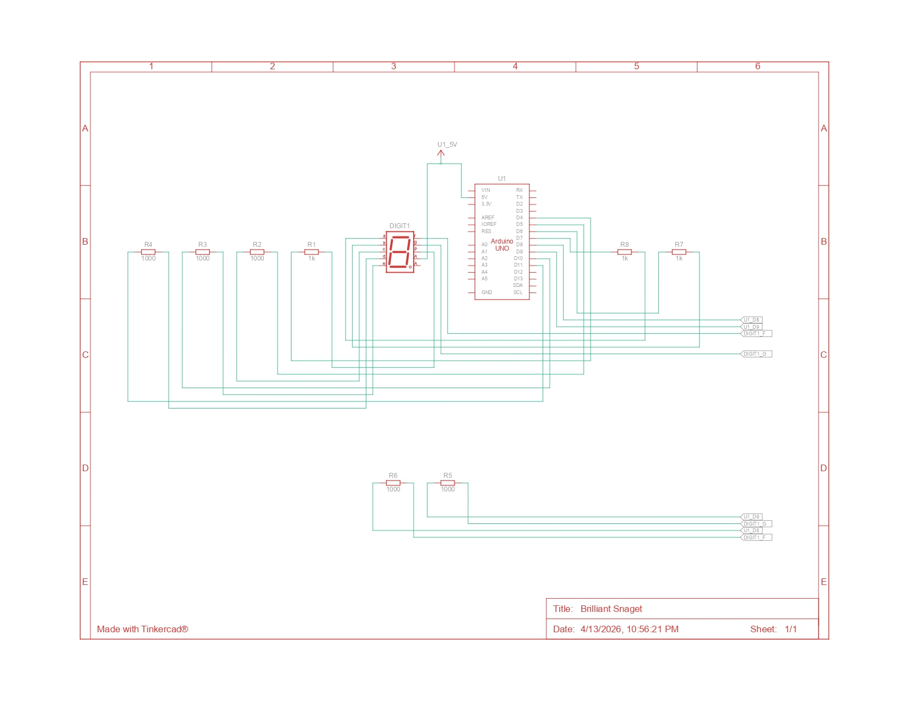

## PRAKTIKUM PEMROGRAMAN SISTEM TERTANAM

## Pertanyaan Praktikum Modul 2: Seven segment

1. Gambarkan rangkaian schematic yang digunakan pada percobaan!
2. Apa yang terjadi jika nilai num lebih dari 15?
3. Apakah program ini menggunakan common cathode atau common anode? Jelaskan alasanya!
4. Modifikasi program agar tampilan berjalan dari F ke 0 dan berikan penjelasan disetiap baris kode nya dalam bentuk README.md

## Jawaban

### 1. Rangkaian Skematik



### 2. Nilai num lebih dari 15

Jika nilai `num` lebih dari `15`, maka program akan mencoba mengakses data di luar batas array `digitPattern`, karena array tersebut hanya memiliki indeks `0` sampai `15`.

Akibatnya:

- Program dapat menampilkan pola segment yang salah atau tidak sesuai.
- Arduino bisa mengambil data acak dari memori.
- Pada kondisi tertentu, perilaku program menjadi tidak stabil karena terjadi `out of bounds access`.

Pada program ini, kondisi tersebut tidak terjadi di `loop()` karena nilai yang dikirim ke `displayDigit(i)` hanya dari `0` sampai `15`.

### 3. Common anode

Program ini menggunakan **common anode**.

Alasannya adalah pada fungsi:

```ino
digitalWrite(segmentPins[i], !digitPattern[num][i]);
```

Nilai pada `digitPattern` menggunakan `1` untuk menandakan segmen **menyala** dan `0` untuk **mati**. Namun saat dikirim ke pin, nilainya dibalik dengan operator `!`.

Artinya:

- Jika pola bernilai `1` , maka `!1` menjadi `0` atau `LOW`.
- Jika pola bernilai `0` , maka `!0` menjadi `1` atau `HIGH`.

Pada seven segment **common anode**, segmen akan menyala saat pin diberi logika `LOW`, sehingga pembalikan logika ini menunjukkan bahwa rangkaian yang digunakan adalah common anode.

### 4. Modifikasi Program

```ino
// Program seven segment untuk menampilkan karakter dari F ke 0

const int segmentPins[8] = {7, 6, 5, 11, 10, 8, 9, 4};
// Array pin untuk segmen a, b, c, d, e, f, g, dan dp

byte digitPattern[16][8] = {
  {1,1,1,1,1,1,0,0}, // Pola angka 0
  {0,1,1,0,0,0,0,0}, // Pola angka 1
  {1,1,0,1,1,0,1,0}, // Pola angka 2
  {1,1,1,1,0,0,1,0}, // Pola angka 3
  {0,1,1,0,0,1,1,0}, // Pola angka 4
  {1,0,1,1,0,1,1,0}, // Pola angka 5
  {1,0,1,1,1,1,1,0}, // Pola angka 6
  {1,1,1,0,0,0,0,0}, // Pola angka 7
  {1,1,1,1,1,1,1,0}, // Pola angka 8
  {1,1,1,1,0,1,1,0}, // Pola angka 9
  {1,1,1,0,1,1,1,0}, // Pola huruf A
  {0,0,1,1,1,1,1,0}, // Pola huruf b
  {1,0,0,1,1,1,0,0}, // Pola huruf C
  {0,1,1,1,1,0,1,0}, // Pola huruf d
  {1,0,0,1,1,1,1,0}, // Pola huruf E
  {1,0,0,0,1,1,1,0}  // Pola huruf F
};
// Array 2 dimensi untuk menyimpan pola tampilan 0 sampai F

void displayDigit(int num)
{
  for (int i = 0; i < 8; i++)
  {
    // Logika dibalik karena seven segment yang dipakai adalah common anode
    digitalWrite(segmentPins[i], !digitPattern[num][i]);
  }
}

void setup()
{
  for (int i = 0; i < 8; i++)
  {
    // Semua pin segmen diatur sebagai output
    pinMode(segmentPins[i], OUTPUT);
  }
}

void loop()
{
  for (int i = 15; i >= 0; i--)
  {
    // Menampilkan karakter mulai dari indeks 15 yaitu F sampai 0
    displayDigit(i);
    // Jeda 1 detik sebelum pindah ke karakter berikutnya
    delay(1000);
  }
}
```
